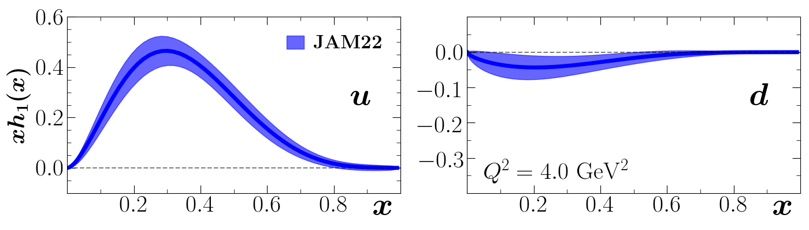
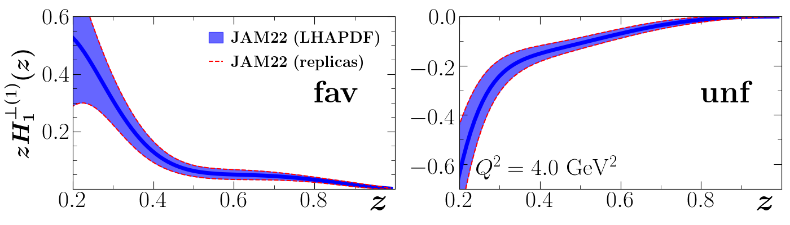
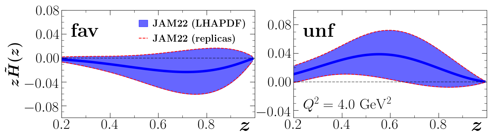
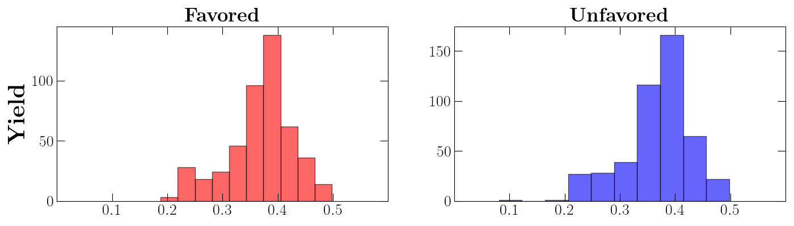

# WormGearLHAPDF

* Copy the directory with the msr files that you want to convert into LHAPDF into this directory
* To generate the LHAPDF files, use the command ```./genlhapdf -d wdir -f function```
* The resulting files will be stored in ```results/data```
* The options for function are transversity, collinspi, Htildepi, and sivers
* Note that index 0000 contains the mean value of the replicas.  Indices 0001 and above are the replicas.
* Use ```./plot.py``` to load the LHAPDF files and generate the three plots below
* The resulting plots will be stored in ```results/gallery```
* To learn how to load and use the distributions and widths, look at the functions within ```plot.py```


Recreated plots from [JAM22][JAM22]:

Transversity PDFs:


Collins pion function (first moment):


Htilde pion:


Widths for Collins pion function:



[JAM22]: https://arxiv.org/abs/2205.00999


